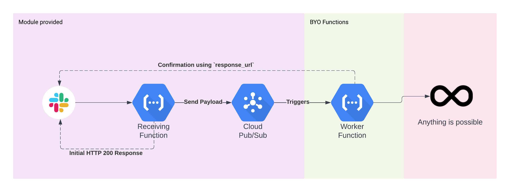

# slackbot-cloud-function
A Cloud Function driven Slackbot that responds to `/slash` commands! :robot:


## Architecture



## Slackbot Usage Instructions

1. Consume the module in your Terraform using the syntax in the [`/examples`](examples/README.md) folder. Or see `Examples` section below!
2. You will need to provide your Python function that will act as the Worker instance to perform the commands that you want. An example of what this looks like can be found in [`/examples`](examples/worker_function_example)
3. You will need to generate a new [Slack App](https://api.slack.com/apps/) and get the 'Signing Secret' from the main page - this will need to be used for the `var.slack_secret` variable.
4. Once the Cloud Function has been spun up you can use the ouput `"function_url"` to get the `http` link for use in creating a new `/slash` command. This can be created in the `Slash Commands` section of your new Slack App.
5. Once the command is created and the Slack App installed into your Slack org you can begin using it!

## Requirements

1. This module enables them but the following APIs are required to be enabled:
   1. Pub/Sub
   2. Cloud Functions
   3. Secrets Manager
   4. Cloud Build
2. You will also need to be able to add unauthenticated users to the IAM invokers so any org policies enforcing authenticated users will break this. Review your org policies first!

## Template Usage Instructions :sparkles:

1. Ensure you create your Terraform Module in the root of this directory
2. Create new examples in `/examples/`
3. Create new releases by creating tags with the name `v220317` - e.g. version by v-Year-Month-Day - also known as CalVer

## GitHub Actions

This repo has 4 built in GitHub Actions:

1. Security scan using tfsec - ensure no IaC errors. To delete remove the file `.github/workflows/main.yml`
2. Terraform-Docs - documentation is automatically taken care of by Terraform-Docs which fills in info in the `README.md` of each section.
3. Automated release - Create new releases by creating tags with the name `v220317` - e.g. version by v-Year-Month-Day - also known as CalVer.
4. Bandit Python Security Checks.

<!-- BEGIN_TF_DOCS -->


## Example

```hcl
module "slackbot" {
  source                = "../"
  name                  = var.name
  path                  = var.path
  description           = var.description
  project               = var.project
  region                = var.region
  slack_secret          = var.slack_secret
  environment_variables = var.environment_variables
}

output "url" {
  value = module.slackbot.function_url
}
```

## Resources

| Name | Type |
|------|------|
| [google_cloudfunctions_function.function](https://registry.terraform.io/providers/hashicorp/google/latest/docs/resources/cloudfunctions_function) | resource |
| [google_cloudfunctions_function_iam_member.invoker](https://registry.terraform.io/providers/hashicorp/google/latest/docs/resources/cloudfunctions_function_iam_member) | resource |
| [google_project_iam_binding.project_binding](https://registry.terraform.io/providers/hashicorp/google/latest/docs/resources/project_iam_binding) | resource |
| [google_project_service.project](https://registry.terraform.io/providers/hashicorp/google/latest/docs/resources/project_service) | resource |
| [google_pubsub_topic.main](https://registry.terraform.io/providers/hashicorp/google/latest/docs/resources/pubsub_topic) | resource |
| [google_secret_manager_secret.secret](https://registry.terraform.io/providers/hashicorp/google/latest/docs/resources/secret_manager_secret) | resource |
| [google_secret_manager_secret_version.version](https://registry.terraform.io/providers/hashicorp/google/latest/docs/resources/secret_manager_secret_version) | resource |
| [google_storage_bucket.bucket](https://registry.terraform.io/providers/hashicorp/google/latest/docs/resources/storage_bucket) | resource |
| [google_storage_bucket_object.zip](https://registry.terraform.io/providers/hashicorp/google/latest/docs/resources/storage_bucket_object) | resource |
| [archive_file.source](https://registry.terraform.io/providers/hashicorp/archive/latest/docs/data-sources/file) | data source |

## Modules

No modules.

## Inputs

| Name | Description | Type | Default | Required |
|------|-------------|------|---------|:--------:|
| <a name="input_description"></a> [description](#input\_description) | The description of your function | `string` | n/a | yes |
| <a name="input_environment_variables"></a> [environment\_variables](#input\_environment\_variables) | Any additional environment variables you want inside the Slackbot Functions | `map(any)` | `{}` | no |
| <a name="input_name"></a> [name](#input\_name) | The name of your function | `string` | n/a | yes |
| <a name="input_path"></a> [path](#input\_path) | The path of your function | `string` | n/a | yes |
| <a name="input_project"></a> [project](#input\_project) | The project you wish to deploy the Slackbot Functions in | `string` | n/a | yes |
| <a name="input_region"></a> [region](#input\_region) | The region the Slackbots will be deployed into | `string` | n/a | yes |
| <a name="input_slack_secret"></a> [slack\_secret](#input\_slack\_secret) | The Slack API secret that you will be deploying - will be wrapped into a Google Secret and deployed | `string` | n/a | yes |

## Outputs

| Name | Description |
|------|-------------|
| <a name="output_function_url"></a> [function\_url](#output\_function\_url) | The URL that will need to be provided to your Slackbot. |
<!-- END_TF_DOCS -->
